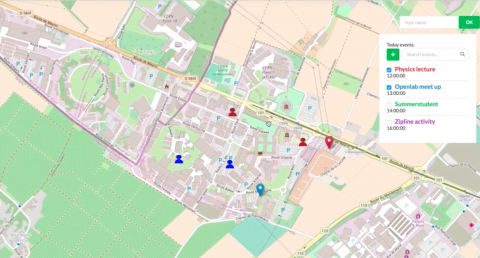

# CERN-Connect

This project was presented at the [CERN Webfest Hackaton 2018](https://webfest.web.cern.ch/content/cern-connect)

CERN-Connect is a web application that connects people and events around CERN using geolocalization. Our platform displays events and participants on a map, allowing for an interactive event discovery and effortless coordination with other attendees.

<p align="center">
  
</p>


## How does it work?

The project is divided into 2 main components:

### 1) Back-end:

Created using Python and a web microframework called [Flask](http://flask.pocoo.org) to deploy the server where the clients could connect. In order to comunicate it with the front-end, there are 3 end-points:

#### /upload

**Send:**

```json
{
    "location": [345.3563464, 234.2452345],
    "name": "<Person's name>",
    "events": [345634563456, 3456345667567, 857845785687]
}
```

**Receive:** -

#### /fetch

**Send:**
```json
{
    "events": [345634563456, 3456345667567, 857845785687]
}
```

#### **Receive:**

```json
[
    {
        "name": "BBQ",
        "location": [345.3563464, 234.2452345],
        "members": [
            {
                "name": "<Person's name>",
                "location": [45.234, 24.7567]
            },
        ]
    },
]
```


### /events

**Send:** -

**Receive:**
```json
[
    {
        "id": 3453563464,
        "name": "BBQ",
    },
]
```

### 2) Front-end:

Created using HTML and Javascript, joinly with a map representation library called [Leaflet](https://leafletjs.com).


## What is in the repository:

The repository contains:
- The source within the folder `src`. The proper Python backend is contained in `main.py`, whhile the front-end files are stored in the static folder.
- The PowerPoint presentation.


## Usage:

First of all, the back-end needs to be deployed. In order to do so:
```
$ python3 main.py
```

Once the server is running, you can access it at *http://localhost:8080*, to see a simulation of events, with user attending them. It should be clear at this point that the data represented in the web application is simulated, being statically stored in the back-end.


## Authors and Recognition:

This project was built by a group of passionate developers who team up during a weekend to create something awesome.

- Sinclert Perez (sinclert@hotmail.com)
- Neha Gupta (gneha21@yahoo.in)
- Filipe Magalhaes (filipepgmagalhaes@tecnico.ulisboa.pt)
- Varsha Rao (rvarsha016@gmail.com)
- Millissa Si Amer (em_si_amer@esi.dz)

The project was finally awarded with the **1st price at the Hackaton!**


